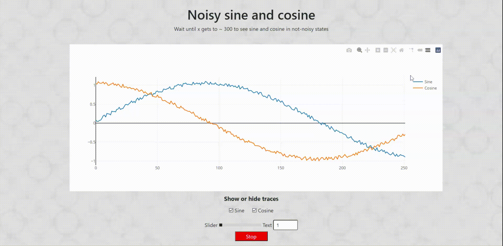

# Real-Time-Graph-Plotly-JS
A webpage where data are fetched from remote server by using EventSource API. Script parses data and shows it in a graph using Plotly.js. 

Data points are actually sine and cosine points, you can see these functions forming more accurately the longer you keep retrieving data.

Slider and text is implemented with a web component.

## Tech stack

## Showcase

